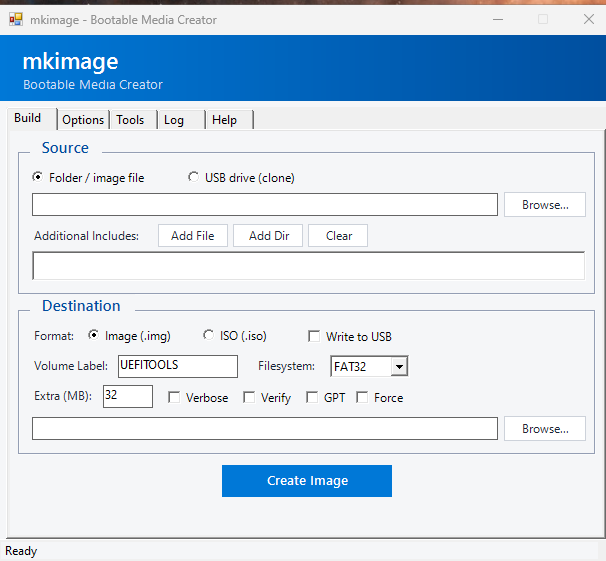

# mkimage

Cross-platform tool for creating bootable disk images, ISOs, and writing to
USB drives. Point it at a directory of files and it produces bootable media —
no admin/root required for the common paths, and no external tools on Windows.

Runs on **Linux, macOS, and Windows** from a single self-contained file
(`mkimage.pyz`), with a CLI and an optional GUI.



*The native PowerShell/WinForms GUI on Windows (the default there). Linux and
macOS get a matching Dear PyGui interface.*

## Features

- **FAT32 disk images** (`.img`) — pure-Python writer, no mtools/admin needed
- **GPT** and **MBR** partition tables, including multi-partition layouts
- **Bootable ISOs** (ISO 9660 + Joliet, UEFI El Torito boot)
- **Write directly to USB** with safety checks (removable-only, size limits,
  explicit confirmation)
- **Modify** existing images (add/remove files) and **verify** writes (SHA256)
- **Tools**: format, wipe partition signatures, bad-block check, list contents
- exFAT / NTFS / ext4 / UDF partitions where the platform supports them
- **GUI** with full keyboard navigation, plus the CLI. On Windows the
  native PowerShell WinForms GUI is the default; elsewhere it's Dear PyGui
  (auto-installed, Tkinter fallback). Override with `--native-gui` /
  `--python-gui`.

## Requirements

- **Python 3.7+** (that's it for image/USB creation)
- GUI: `dearpygui` (auto-installed on first launch; falls back to Tkinter)
- Some advanced filesystems use native tools where available (`mkfs.exfat`,
  `mkfs.ntfs`, `xorriso`, …). Run `mkimage --check` to see what's available.

## Install

Download `mkimage.pyz` from the [Releases](../../releases) page and run it:

```bash
python3 mkimage.pyz --help
```

On Windows, `.pyz` is associated with Python, so you can also double-click it
to launch the GUI. (The Windows ISO/format paths are handled by an embedded
PowerShell helper inside the `.pyz` — nothing else to install.)

Verify your download against the published `SHA256SUMS`.

## Usage

```bash
# FAT32 image from a directory
mkimage.pyz --source <dir> --target output.img

# GPT with an EFI System Partition + a data partition
mkimage.pyz --source <dir> --target output.img --gpt \
    --partition esp::BOOT --partition fat32:0:DATA:./data/

# Bootable ISO
mkimage.pyz --source <dir> --target output.iso

# Write to a USB drive (auto-detect, with confirmation)
mkimage.pyz --source <dir> --target usb

# Write an existing image to USB
mkimage.pyz --source output.img --target usb

# Verify after writing (SHA256)
mkimage.pyz --source <dir> --target output.img --verify

# Compressed output
mkimage.pyz --source <dir> --target output.img.gz

# Modify an existing image
mkimage.pyz --modify output.img --add newfile.txt --remove old.txt

# Tools
mkimage.pyz --list-drives          # list removable drives
mkimage.pyz --wipe /dev/sdb        # wipe partition signatures
mkimage.pyz --check-usb /dev/sdb   # bad-block check (destructive)
mkimage.pyz --check                # show available tools/filesystems

# Launch the GUI (also the default with no arguments)
mkimage.pyz --gui                  # native on Windows, Dear PyGui elsewhere
mkimage.pyz --native-gui           # force the native PowerShell GUI (Windows)
mkimage.pyz --python-gui           # force the Dear PyGui interface
```

Run `mkimage.pyz --help` for the full option list.

### GUI keyboard shortcuts

`F1`–`F5` switch tabs (Build / Options / Tools / Log / Help) · `F6` refresh
USB list · `F7`/`F8`/`F9` Format / Wipe / Check · `F12` Create / Write.

## Build from source

```bash
python3 build_pyz.py     # produces mkimage.pyz
```

The package is stdlib-only (Python 3.7+); the GUI's `dearpygui` is the sole
optional runtime dependency.

## Notes

- USB writes always run safety checks and require confirmation (or `--force`).
- **UEFI:NTFS** support (for booting NTFS USBs) is downloaded on demand from
  its upstream project (GPL-2.0); it is not bundled with mkimage.

## License

MIT — see [LICENSE](LICENSE).
